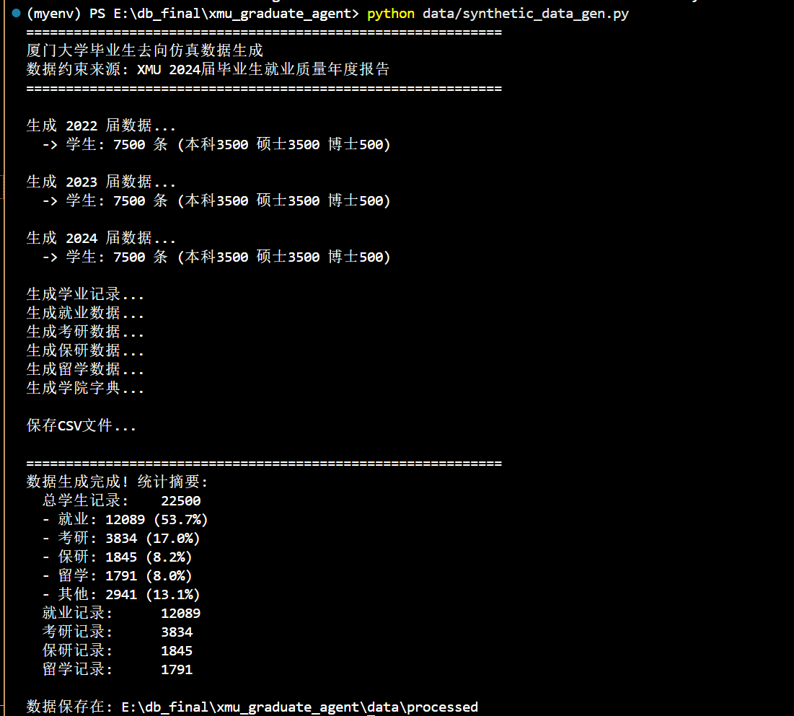
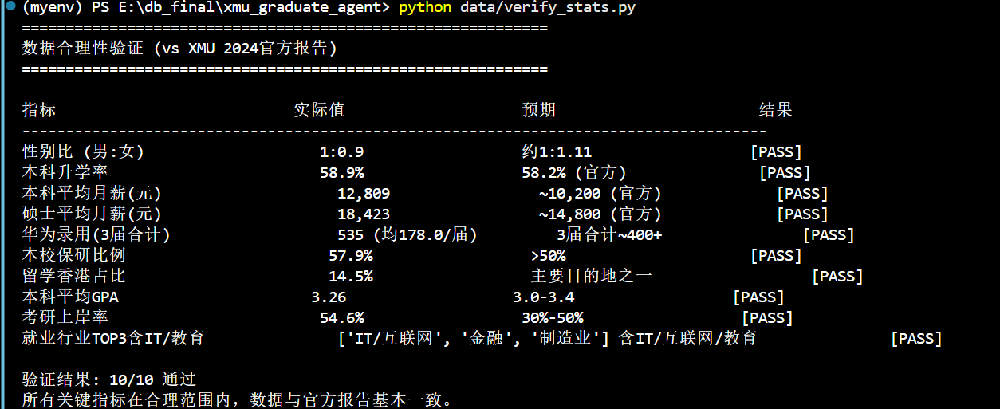
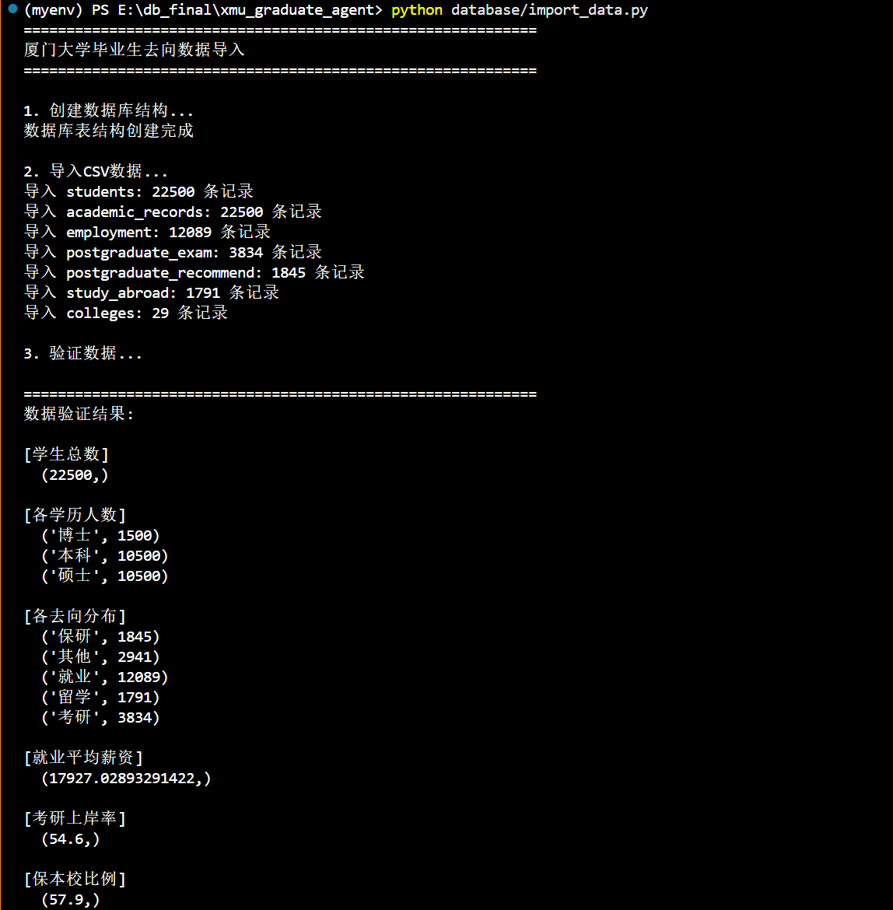
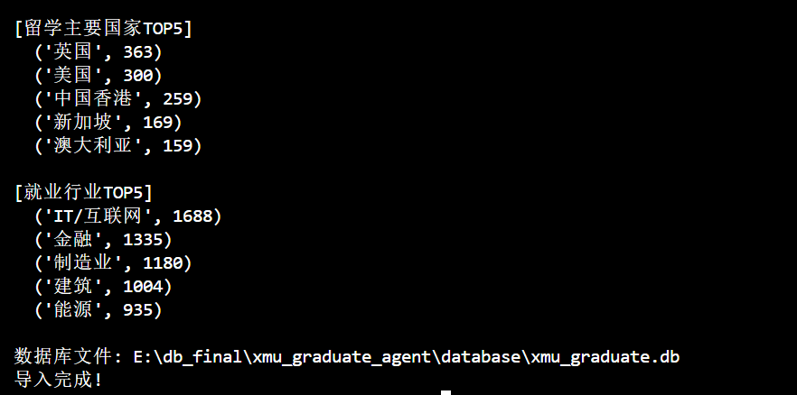
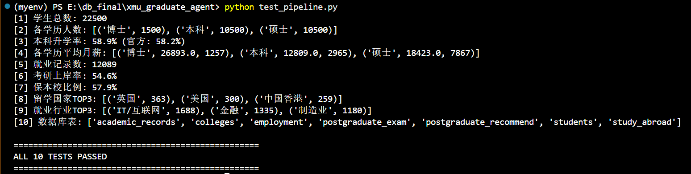

# GradCompass — 厦门大学毕业生去向数据分析智能体

> *Guide every XMU graduate toward their next horizon.*

数据库系统原理 · 实验七综合实践

---

## 演示视频


---

## 快速开始

### 1. 创建虚拟环境

```bash
# Windows (PowerShell)
python -m venv venv
.\venv\Scripts\activate

# macOS / Linux
python3 -m venv venv
source venv/bin/activate
```

### 2. 安装依赖

```bash
pip install -r requirements.txt
```

核心依赖：`pandas` `numpy` `faker` `sqlalchemy` `langchain` `langchain-community` `langchain-openai` `streamlit` `plotly` `python-dotenv`

### 3. 配置 LLM API Key

在项目根目录创建 `.env` 文件：

```
DEEPSEEK_API_KEY=sk-xxxxxxxxxxxxxxxx
```

> 也可在 `agent/config.py` 中直接修改，支持 DeepSeek / 阿里千问 / 本地 Ollama 三种方案。

### 4. 生成仿真数据

```bash
python data/synthetic_data_gen.py
```



输出约 22,500 条学生记录（2022-2024 三届），保存至 `data/processed/`。

### 5. 校验数据

```bash
python data/verify_stats.py
```



对照 XMU 官方就业报告校验关键统计指标（预期 10/10 通过）。

### 6. 导入数据库

```bash
python database/import_data.py
```





创建 SQLite 数据库 `database/xmu_graduate.db`，导入全部 7 张表。

### 7. 完整性测试

```bash
python test_pipeline.py
```



验证 10 项关键指标（数据量、升学率、薪资范围、表结构等）。

### 8. 启动可视化应用

```bash
streamlit run app/streamlit_app.py
```

浏览器访问 `http://localhost:8501`。

---

## 项目结构

```
GradCompass/
├── data/
│   ├── synthetic_data_gen.py      # 仿真数据生成脚本
│   ├── verify_stats.py            # 数据合理性校验
│   └── processed/                 # 生成的 7 个 CSV 文件
├── database/
│   ├── create_tables.sql          # 建表 DDL
│   ├── import_data.py             # CSV → SQLite 导入
│   ├── query_samples.sql          # 15 个示例查询
│   └── xmu_graduate.db            # SQLite 数据库
├── agent/
│   ├── __init__.py
│   ├── config.py                  # LLM 配置
│   ├── db_connection.py           # 数据库连接
│   ├── prompts.py                 # Prompt 模板
│   └── sql_agent.py               # Data Agent 核心
├── app/
│   └── streamlit_app.py           # Streamlit 可视化 (5 Tab)
├── screenshots/                   # 运行截图
├── display.gif                    # 演示视频 (GIF)
├── requirements.txt
├── test_pipeline.py
├── README.md
└── 实验报告.md
```

---

## 一键运行

```bash
# 激活虚拟环境后
python data/synthetic_data_gen.py && python data/verify_stats.py && python database/import_data.py && streamlit run app/streamlit_app.py
```

---

## 常见问题

**Q: 运行 `synthetic_data_gen.py` 报错 `ModuleNotFoundError: No module named 'faker'`**

A: 未安装依赖，先执行 `pip install -r requirements.txt`。

**Q: Agent 无法连接大模型**

A: 检查 `agent/config.py` 中的 `api_key` 和 `base_url` 是否正确；确认网络可访问 API 地址。

**Q: Streamlit 页面空白或报错**

A: 确认已执行 `database/import_data.py` 生成 `xmu_graduate.db`；检查 `agent/config.py` 中 `DB_PATH` 路径是否正确。

**Q: 想用本地模型（不花钱）**

A: 安装 Ollama → `ollama pull qwen2.5:7b` → 修改 `agent/config.py` 切换为 Ollama 方案。
