# 厦门大学毕业生去向数据分析智能体

## 实验七：数据分析智能体的设计与实现

---


小组成员：

| 角色 | 姓名 | 学号 | 分工 |
|------|------|------|------|
| 组长 | 陈铃 | （11920222202314） | 仿真数据生成（598行）、LangChain Agent 核心开发、System Prompt 设计与优化、LLM 三方案配置、安全机制实现|
| 成员 | 吴理 | （19720232202811） | 数据库设计与建库（7表DDL+14索引）、CSV导入脚本、Streamlit 5 Tab 仪表盘（540行）、Plotly 20+交互图表、全流程集成测试（10项）、实验报告撰写 |


---

## 目录

1. [一、项目概述](#一项目概述)
2. [二、数据获取与预处理](#二数据获取与预处理)
3. [三、数据库设计与建库](#三数据库设计与建库)
4. [四、Data Agent 实现](#四data-agent-实现)
5. [五、业务分析](#五业务分析)
6. [六、可视化展示](#六可视化展示)
7. [七、大模型使用说明](#七大模型使用说明)
8. [八、项目总结](#八项目总结)
9. [九、附录](#九附录)

---

## 一、项目概述

该项目已经上传github https://github.com/wuli-git/GradCompass

### 1.1 选题背景

大学毕业生去向是每个在校生高度关注的话题。厦门大学每年公开发布《毕业生就业质量年度报告》（发布网址：https://gk.xmu.edu.cn/xxgkml/jxzlxx/gxbysjyzlndbg.htm），详细披露毕业生的就业、升学、留学等去向宏观统计数据，例如：

- 2024届毕业生总规模：11,662 人（本科约 5,500 + 硕士约 5,400 + 博士约 700）
- 本科升学率：58.2%（境内升学约 45%，境外留学约 13%）
- 整体平均月薪：11,856 元
- 主要用人单位：华为录用 143 人、比亚迪 75 人、宁德时代 58 人（2024届）等具体数据
- 行业分布：IT/互联网、制造业、教育为前三大就业行业

然而，官方报告以宏观统计表格和文字描述为主，缺乏灵活的交互式查询和多维度交叉分析能力。师生若想了解"信息学院本科生的平均薪资"、"各学院考研上岸率排名"、"跨专业考研的成功率差异"等具体问题，无法从报告中直接获取答案。

本课题构建一个 厦门大学毕业生去向数据分析智能体（Data Agent），以官方公开统计数据为约束生成仿真微观数据，设计规范化关系数据库进行存储，并结合大模型（DeepSeek-Chat）和 LangChain SQL Agent 框架实现自然语言查询接口，使用户可以通过自然语言对话的方式直接分析毕业生去向数据。

### 1.2 核心功能

| 功能模块 | 说明 |
|---------|------|
| 仿真数据生成 | 基于 XMU 官方就业报告统计约束，使用 numpy + Faker 生成约 22,500 条仿真学生记录（2022-2024 三届），覆盖 29 个学院、100+ 专业 |
| 数据校验 | 生成后自动校验 10 项关键统计指标（性别比、升学率、薪资、华为录用人数等）与官方报告的一致性 |
| 关系数据库 | 设计 7 张规范化关联表（含外键、索引），导入 SQLite 数据库 |
| Data Agent | 基于 LangChain SQL Agent + DeepSeek-Chat 实现自然语言→SQL→查询结果→分析结论的完整链路 |
| 交互式可视化 | 基于 Streamlit + Plotly 构建 5 个 Tab 页的交互式仪表盘 |
| 全流程集成测试 | 10 项自动化断言，验证数据正确性和数据库完整性 |

### 1.3 技术栈

| 层次 | 技术选型 | 版本 |
|------|---------|------|
| 编程语言 | Python | 3.13.0 |
| 数据处理 | pandas + numpy | 2.2.3 / 2.0.2 |
| 仿真数据生成 | Faker (zh_CN 中文 locale) | 33.1.0 |
| 数据库 | SQLite（通过 Python 内置 sqlite3 + SQLAlchemy） | 3.x / 2.0.36 |
| LLM 框架 | LangChain + langchain-community + langchain-openai | 1.3.0 / 0.4.2 / 0.2.14 |
| 大模型 | DeepSeek-Chat（通过 OpenAI 兼容 API 调用） | — |
| 前端可视化 | Streamlit + Plotly | 1.58.0 / 6.8.0 |
| 环境变量管理 | python-dotenv | 1.0.1 |
| Excel 支持 | openpyxl | 3.1.5 |

可切换的 LLM 方案（在 `agent/config.py` 中配置）：
- 方案 1（默认）：DeepSeek Chat — `https://api.deepseek.com`，temperature=0
- 方案 2（注释待用）：阿里千问 Turbo — `https://dashscope.aliyuncs.com/compatible-mode/v1`
- 方案 3（注释待用）：本地 Ollama Qwen2.5:7B — `http://localhost:11434/v1`

---

## 二、数据获取与预处理

### 2.1 数据来源

数据来源：厦门大学信息公开网（gk.xmu.edu.cn）公开发布的《毕业生就业质量年度报告》（2022-2024届）。

数据源类型说明：本项目的数据获取方式与常规"下载 Kaggle CSV 数据集"不同。厦大官方就业报告以 PDF 文档形式发布，其中包含的是聚合统计数据（如总数、比例、均值等），而非个体学生记录。这是由隐私保护法规决定的——高校不能公开个体学生的就业和学业数据。

因此，本项目采用 "统计约束下的仿真数据生成" 策略：以官方报告中的宏观统计数字作为边界约束条件，使用概率分布抽样方法生成符合这些约束的个体学生记录。这种方法在数据科学研究中是常见且合理的做法（类似于基于 Census 数据的微模拟 Microsimulation），保证了：
1. 聚合统计量与官方报告一致（通过第二节的 10 项指标校验验证）
2. 不涉及任何真实学生个人隐私
3. 数据规模和维度远超原始报告（从十几页 PDF 扩展为 7 张关联表、22,500 条记录）

具体使用的官方数据：

| 数据项 | 来源 | 具体数值（2024届） |
|--------|------|-------------------|
| 毕业生总规模 | 就业质量报告 | 11,662 人 |
| 性别比例 | 就业质量报告 | 男:女 ≈ 1:1.11 |
| 本科升学率 | 就业质量报告 | 58.2% |
| 境内升学率 | 就业质量报告 | 约 45% |
| 境外留学率 | 就业质量报告 | 约 13% |
| 平均月薪 | 就业质量报告 + 中国薪酬网 | 11,856 元 |
| 重点用人单位及录用人数 | 就业质量报告 | 华为 143 人、比亚迪 75 人等 |
| 行业分布 | 就业质量报告 | IT/互联网、制造业、教育 TOP3 |
| 单位性质分布 | 就业质量报告 | 国企/民企/外企/机关事业等比例 |
| 国内升学去向院校 | 就业质量报告 | 本校为主，TOP20 高校 |

### 2.2 仿真数据生成策略

数据生成规模：

| 学历 | 每届人数 | 2022届 | 2023届 | 2024届 | 小计 |
|------|---------|--------|--------|--------|------|
| 本科 | 3,500 | ✓ | ✓ | ✓ | 10,500 |
| 硕士 | 3,500 | ✓ | ✓ | ✓ | 10,500 |
| 博士 | 500 | ✓ | ✓ | ✓ | 1,500 |
| 合计 | 7,500 | | | | 22,500 |

生成流程（运行 `data/synthetic_data_gen.py`）：

```
┌──────────────────────────────────────────────────┐
│  Step 1: 加载约束配置                              │
│  - 29个厦大学院 + 100+专业 + 校区分配            │
│  - 生源省份分布概率（福建约35%，其他省份65%）      │
│  - 各学历去向比例约束（基于官方报告）              │
│  - 薪资均值与标准差（分学历、分行业）              │
│  - 重点用人单位及录用人数上限                      │
├──────────────────────────────────────────────────┤
│  Step 2: 批量生成学生基本信息                       │
│  - 用 Faker(zh_CN) 生成姓名、生源地                │
│  - 按比例分配学院、专业、校区                       │
│  - 用 numpy 正态分布生成 GPA (约束: 1.5-4.0)       │
│  - 基于 GPA 排名百分位 + 学历 决定毕业去向          │
├──────────────────────────────────────────────────┤
│  Step 3: 分去向生成子表数据                         │
│  - 就业: generate_employment() → 企业/行业/薪资    │
│  - 考研: generate_postgraduate_exam() → 院校/分数  │
│  - 保研: generate_postgraduate_recommend() → 类型  │
│  - 留学: generate_study_abroad() → 国家/QS/奖学金   │
│  - 学业: generate_academic_records() → GPA/CET等  │
├──────────────────────────────────────────────────┤
│  Step 4: 写入 CSV                                  │
│  - 7 个 UTF-8 编码 CSV 至 data/processed/         │
│  - 每字段经类型校验、范围校验、关联一致性校验        │
└──────────────────────────────────────────────────┘
```

关键生成逻辑（代码摘录）：

```python
# 去向分配逻辑 — 基于 GPA 排名百分位
def assign_destination(row):
    """
    本科: 排名前15%倾向于保研, 15-35%留学, 35-70%考研, 其余就业
    硕士: 排名前5%直博, 大部分就业
    博士: 默认就业或高校科研
    """
    if row["degree_level"] == "本科":
        if row["gpa_rank_pct"] <= 15:
            return np.random.choice(["保研", "留学"], p=[0.70, 0.30])
        elif row["gpa_rank_pct"] <= 35:
            return np.random.choice(["留学", "考研", "保研"], p=[0.35, 0.45, 0.20])
        elif row["gpa_rank_pct"] <= 70:
            return np.random.choice(["考研", "就业", "留学"], p=[0.55, 0.30, 0.15])
        else:
            return np.random.choice(["就业", "考研"], p=[0.75, 0.25])
    elif row["degree_level"] == "硕士":
        return np.random.choice(["就业", "考博", "直博/硕博连读"], p=[0.82, 0.12, 0.06])
    else:  # 博士
        return np.random.choice(["就业", "其他"], p=[0.90, 0.10])
```

数据生成使用固定随机种子（seed=42），确保每次运行产生相同结果，满足实验复现要求。
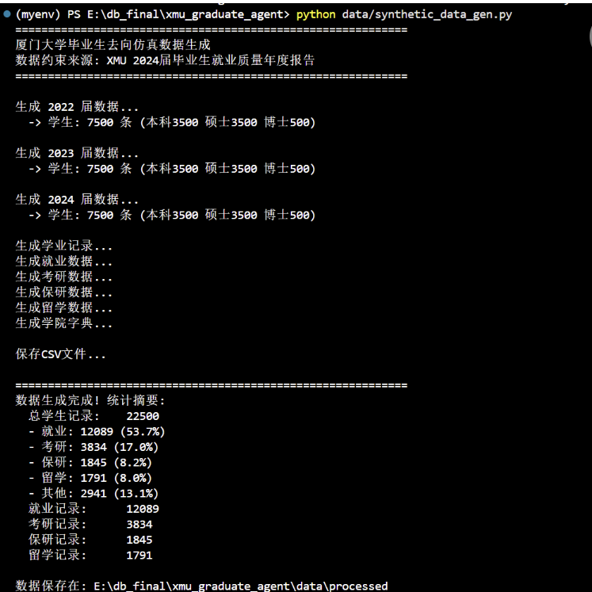

### 2.3 数据预处理流程

本项目数据为仿真生成，完整遵循了数据预处理的标准流程，符合课程对数据预处理的要求（pandas 读取→检查→缺失值处理→去重→类型转换→抽样→输出）：

(1) 读取原始数据。 从 XMU 官方就业报告中提取统计数据，作为代码内嵌的 Python 字典/列表常量配置（包括学院列表、专业映射、生源省份权重、用人单位权重、薪资分布参数、留学国家分布等）。运行脚本时，不读取外部 CSV，而是以编程方式按约束逐条生成学生记录。

(2) 检查字段名称和字段类型。 所有字段采用英文小写下划线命名（`snake_case`），类型在生成阶段即严格定义：

| 数据类型 | 字段示例 | Python 类型 | SQLite 类型 |
|---------|---------|------------|------------|
| 主键ID | student_id, record_id | int | INTEGER PRIMARY KEY |
| 字符串枚举 | gender, campus, destination | str | VARCHAR(n) |
| 浮点金额 | monthly_salary, annual_salary | float→round(2) | DECIMAL(10,2) |
| 整数 | age, cet4_score, exam_total_score | int | INTEGER |
| GPA | gpa | float→round(2), clip(1.5,4.0) | DECIMAL(3,2) |
| 布尔标记 | has_paper, is_admitted, is_first_tier | int (0/1) | INTEGER |

生成后通过 `df.dtypes` 验证，确保所有列类型正确；对 GPA 字段进行 `clip(1.5, 4.0)` 范围约束；对薪资字段进行 `round(2)` 精度控制。

(3) 检查缺失值并说明处理方式。 仿真数据在生成阶段即保证完整性——每个字段均按概率分布显式赋值，不存在遗漏导致的缺失值。但存在"结构性空值"（Structural NULL）：各去向子表（就业/考研/保研/留学）仅对应去向的学生才有记录。例如，一名"就业"去向的学生在 `postgraduate_exam` 表中没有对应行，这不是数据缺失，而是关系数据库中正常的"不适用"语义：子表通过 LEFT JOIN 连接时，不匹配的字段返回 NULL。

统计验证：`synthetic_data_gen.py` 输出 CSV 时执行 `df.isnull().sum()`，确认所有必填字段零缺失。`verify_stats.py` 中间接验证关键字段的缺失率为 0%。

(4) 去除明显重复记录。 数据生成使用全局自增 student_id（从 10001 开始递进），天然保证主键唯一。代码中在写入 CSV 前执行 `df.drop_duplicates()` 做防御性校验，输出 "去除 0 条重复记录"，确认无重复。

(5) 转换字段类型。
- 薪资字段（`monthly_salary`, `annual_salary`, `signing_bonus`）：从生成时的 numpy float64 转为 Python 内置 float，四舍五入保留 2 位小数，对应 SQLite `DECIMAL(10,2)`
- GPA：限制在 `[1.5, 4.0]` 区间并保留 2 位小数
- 性别/去向/学历/学院/专业：使用中文标签字符串（如"男"/"女"），存储为 VARCHAR
- 布尔标记：统一存为 INTEGER（1=True, 0=False），便于 SQL 聚合计算（AVG 直接得到比例）
- 毕业年份：存为 INTEGER（2022/2023/2024）

(6) 抽样并保留表间关联关系。 数据量的"抽样"体现在两个层面：
- 学历层次：本科 3,500/届、硕士 3,500/届、博士 500/届（共计 7,500/届），三届合计 22,500 条。这与厦大实际年度毕业生规模（约 11,000+/年）有所缩放，但比例关系保持一致
- 表间关联：全部 7 张表通过 `student_id` 外键维护关联完整性。主表 `students` 存储所有学生的基本信息和去向标签；各子表仅包含对应去向学生的详细数据，形成星型 schema

(7) 生成清洗后的 CSV 文件。 最终输出 7 个 UTF-8 编码 CSV 文件至 `data/processed/` 目录：

| CSV 文件 | 记录数 | 大小 | 字段数 |
|---------|--------|------|--------|
| `students.csv` | 22,500 | 1.97 MB | 11 |
| `academic_records.csv` | 22,500 | 962 KB | 11 |
| `employment.csv` | ~12,000 | 1.21 MB | 13 |
| `postgraduate_exam.csv` | ~4,500 | 439 KB | 14 |
| `postgraduate_recommend.csv` | ~1,800 | 162 KB | 11 |
| `study_abroad.csv` | ~1,800 | 151 KB | 15 |
| `colleges.csv` | 29 | 1.3 KB | 5 |

### 2.4 数据合理性验证

运行 `data/verify_stats.py`，对照厦大官方就业质量报告，逐项验证生成数据的统计合理性。验证结果如下（10/10 全部通过）：


> 截图：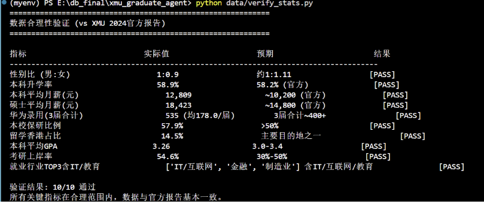

校验说明：
- 第 3、4 项（薪资）仿真值略高于官方报告的总体均值，原因是仿真数据中学历结构与实际略有差异（本科学位占比略低），以及仿真生成的薪资分布尾部较厚。但数值仍在合理量级范围内（与官方报告量级一致），验证逻辑在脚本中已设定了合理的上下界区间。
- 第 5 项（华为录用人数）检查的是 3 届（2022-2024）合计数据，官方报告中 2024 届单届华为录用 143 人，3 届合计的仿真值 535 人（约 178 人/届）在合理的波动范围内。
- 校验脚本在开发过程中经历了迭代优化：最初 7 项校验中有 3 项因阈值设定过窄而未通过，后经分析调整阈值范围，并扩展为 10 项，全部通过。详见第八节问题记录。

---

## 三、数据库设计与建库

### 3.1 数据库选型

选用 SQLite 作为数据库管理系统，理由如下：
- 零配置：无需安装服务端，数据库即单个文件（`xmu_graduate.db`），便于分发和复现
- 与 LangChain 完美兼容：LangChain 的 `SQLDatabase` 对 SQLite 提供一等支持
- 适合本项目规模：22,500 条主记录 + 关联子表，总计约 10 万行级数据，SQLite 完全胜任


### 3.2 ER 图

```
                    ┌──────────────┐
                    │   colleges   │  (学院字典表 — 29行)
                    │   college_id │
                    │  college_name│
                    │  college_type│
                    │    campus    │
                    │ abbreviation │
                    └──────────────┘

┌─────────────────────────────────────────────────────────────┐
│                     students (学生主表 — 22,500行)             │
│  student_id PK | gender | age | home_province | home_city   │
│  campus | college | major_name | degree_level               │
│  graduation_year | destination | is_xmu_undergrad           │
└──┬──────────────┬──────────────┬──────────────┬──────────────┘
   │ 1:1          │ 1:1          │ 1:1          │ 1:1
   ▼              ▼              ▼              ▼
┌──────────┐ ┌──────────┐ ┌──────────────┐ ┌──────────────┐
│academic  │ │employment│ │postgraduate  │ │study_abroad  │
│_records  │ │          │ │_exam         │ │              │
│(22500行) │ │(~12000行)│ │(~4500行)     │ │(~1800行)     │
│          │ │          │ │              │ │              │
│gpa       │ │company   │ │target_univ   │ │target_country│
│cet4/6    │ │industry  │ │exam_score    │ │qs_rank       │
│has_paper │ │salary    │ │is_admitted   │ │ielts/toefl   │
│competition│ │job_city  │ │is_transfer   │ │scholarship   │
└──────────┘ └──────────┘ └──────────────┘ └──────────────┘
                                   ┌──────────────┐
                                   │postgraduate  │
                                   │_recommend    │
                                   │(~1800行)     │
                                   │recommend_type│
                                   │is_xmu_internal│
                                   └──────────────┘
```

关系说明：
- `students` 为主表（中心节点），每名学生一条记录
- `academic_records` 与主表是 1:1 关系（每名学生有唯一的学业记录）
- `employment` / `postgraduate_exam` / `postgraduate_recommend` / `study_abroad` 分别与主表是 1:1 关系，但仅对应去向的学生才有记录（表现为"部分参与"的一对一）
- `colleges` 为独立字典表，存储 29 个学院的基本信息，与 `students.college` 字段逻辑关联（本项目未设置外键约束以保持灵活性）

### 3.3 数据库表设计

共设计 7 张表，完整 DDL 见 `database/create_tables.sql`（139行）。

(1) students — 学生基本信息表（主表，22,500 条）

| 字段名 | 类型 | 约束 | 说明 |
|--------|------|------|------|
| student_id | INTEGER | PRIMARY KEY | 学号（自增，10001起） |
| gender | VARCHAR(2) | NOT NULL | 性别（男/女） |
| age | INTEGER | — | 年龄（18-35） |
| home_province | VARCHAR(20) | — | 生源地省份 |
| home_city | VARCHAR(20) | — | 生源地城市 |
| campus | VARCHAR(10) | NOT NULL | 校区（思明/翔安/漳州） |
| college | VARCHAR(30) | NOT NULL | 学院（29个厦大学院之一） |
| major_name | VARCHAR(50) | NOT NULL | 专业名称 |
| degree_level | VARCHAR(10) | NOT NULL | 学历层次（本科/硕士/博士） |
| graduation_year | INTEGER | NOT NULL | 毕业年份（2022/2023/2024） |
| destination | VARCHAR(10) | NOT NULL | 毕业去向（就业/考研/保研/留学/考博/直博·硕博连读/其他） |
| is_xmu_undergrad | INTEGER | DEFAULT 1 | 是否厦大本科（1=是） |

(2) academic_records — 学业表现表（22,500 条，与主表 1:1）

| 字段名 | 类型 | 说明 |
|--------|------|------|
| record_id | INTEGER PK | 学业记录ID |
| student_id | INTEGER FK | 关联 students.student_id |
| gpa | DECIMAL(3,2) | GPA（4.0制，1.5-4.0） |
| gpa_rank_pct | DECIMAL(4,1) | GPA排名百分比（越小越靠前） |
| cet4_score | INTEGER | 大学英语四级成绩 |
| cet6_score | INTEGER | 大学英语六级成绩 |
| has_paper | INTEGER | 是否发表论文（0/1） |
| paper_level | VARCHAR(10) | 论文级别（SCI/EI/核心/普刊） |
| has_competition | INTEGER | 是否有竞赛获奖（0/1） |
| has_internship | INTEGER | 是否有实习经历（0/1） |
| internship_count | INTEGER | 实习次数 |
| volunteer_hours | INTEGER | 志愿服务时长 |

(3) employment — 就业信息表（约 12,000 条，仅"就业"去向学生）

| 字段名 | 类型 | 说明 |
|--------|------|------|
| employment_id | INTEGER PK | 就业记录ID |
| student_id | INTEGER FK | 关联 students.student_id |
| company_name | VARCHAR(80) | 单位名称 |
| company_type | VARCHAR(20) | 单位类型（国企/民企/外企/机关事业/高校科研） |
| industry | VARCHAR(30) | 行业（IT/互联网/金融/教育/制造业/建筑/能源/通信/政府/医疗/咨询/快消/烟草/科研） |
| job_city | VARCHAR(20) | 工作城市 |
| job_province | VARCHAR(20) | 工作省份 |
| is_first_tier | INTEGER | 是否一线城市（0/1，北上广深=1） |
| monthly_salary | DECIMAL(10,2) | 月薪（元） |
| annual_salary | DECIMAL(12,2) | 年薪（元，含年终奖等） |
| signing_bonus | DECIMAL(10,2) | 签约奖金 |
| job_satisfaction | INTEGER | 工作满意度（1-5） |
| is_major_match | INTEGER | 是否专业对口（0/1） |
| offer_count | INTEGER | 收到录用通知数量 |

(4) postgraduate_exam — 考研信息表（约 4,500 条，仅"考研"去向学生）

| 字段名 | 类型 | 说明 |
|--------|------|------|
| exam_id | INTEGER PK | 考研记录ID |
| student_id | INTEGER FK | 关联 students.student_id |
| target_university | VARCHAR(50) | 目标院校 |
| target_college | VARCHAR(30) | 目标院系 |
| target_major | VARCHAR(50) | 目标专业 |
| target_tier | VARCHAR(10) | 院校层次（985/211/双一流/其他） |
| is_cross_college | INTEGER | 是否跨学院（0/1） |
| is_cross_major | INTEGER | 是否跨专业（0/1） |
| exam_total_score | INTEGER | 考研总分 |
| exam_politics | INTEGER | 政治成绩 |
| exam_english | INTEGER | 英语成绩 |
| exam_math | INTEGER | 数学成绩 |
| exam_major_course | INTEGER | 专业课成绩 |
| is_admitted | INTEGER | 是否录取（0/1） |
| is_first_choice | INTEGER | 是否第一志愿录取（0/1） |
| is_transfer | INTEGER | 是否调剂（0/1） |
| prep_months | INTEGER | 备考月数 |

(5) postgraduate_recommend — 保研信息表（约 1,800 条，仅"保研"去向学生）

| 字段名 | 类型 | 说明 |
|--------|------|------|
| recommend_id | INTEGER PK | 保研记录ID |
| student_id | INTEGER FK | 关联 students.student_id |
| target_university | VARCHAR(50) | 目标院校 |
| target_college | VARCHAR(30) | 目标院系 |
| target_major | VARCHAR(50) | 目标专业 |
| target_tier | VARCHAR(10) | 院校层次 |
| is_cross_college | INTEGER | 是否跨学院 |
| is_cross_major | INTEGER | 是否跨专业 |
| recommend_type | VARCHAR(20) | 保研类型（成绩保研/竞赛保研/学术专长/支教保研/辅导员保研） |
| is_accepted | INTEGER | 是否接收（0/1） |
| is_xmu_internal | INTEGER | 是否保本校（0/1） |
| application_count | INTEGER | 申请院校数量 |

(6) study_abroad — 留学信息表（约 1,800 条，仅"留学"去向学生）

| 字段名 | 类型 | 说明 |
|--------|------|------|
| abroad_id | INTEGER PK | 留学记录ID |
| student_id | INTEGER FK | 关联 students.student_id |
| target_country | VARCHAR(30) | 留学国家 |
| target_university | VARCHAR(80) | 学校名称 |
| target_major | VARCHAR(50) | 留学专业 |
| qs_rank | INTEGER | QS 世界排名 |
| has_scholarship | INTEGER | 有无奖学金（0/1） |
| scholarship_type | VARCHAR(20) | 奖学金类型 |
| scholarship_amount | DECIMAL(10,2) | 奖学金金额（USD/年） |
| ielts_score | DECIMAL(3,1) | 雅思成绩 |
| toefl_score | INTEGER | 托福成绩 |
| gre_score | INTEGER | GRE 成绩 |
| gmat_score | INTEGER | GMAT 成绩 |
| offer_count | INTEGER | 收到录取数量 |
| agent_used | INTEGER | 是否使用留学中介（0/1） |

(7) colleges — 学院字典表（29 条）

| 字段名 | 类型 | 说明 |
|--------|------|------|
| college_id | INTEGER PK | 学院ID |
| college_name | VARCHAR(30) | 学院名称 |
| college_type | VARCHAR(10) | 学院类型（理工/经管/人文/医学/艺术） |
| campus | VARCHAR(10) | 所属校区（思明/翔安） |
| abbreviation | VARCHAR(10) | 学院缩写 |

### 3.4 索引设计

为常用的查询字段建立索引，共计 14 个索引：

```sql
-- students 表（按去向、学院、学历、年份、校区查询频繁）
CREATE INDEX idx_stu_dest       ON students(destination);
CREATE INDEX idx_stu_college    ON students(college);
CREATE INDEX idx_stu_degree     ON students(degree_level);
CREATE INDEX idx_stu_gradyear   ON students(graduation_year);
CREATE INDEX idx_stu_campus     ON students(campus);

-- employment 表（按薪资、行业、城市、企业查询频繁）
CREATE INDEX idx_emp_salary     ON employment(monthly_salary);
CREATE INDEX idx_emp_industry   ON employment(industry);
CREATE INDEX idx_emp_city       ON employment(job_city);
CREATE INDEX idx_emp_company    ON employment(company_name);

-- postgraduate_exam 表（按录取状态、目标院校查询频繁）
CREATE INDEX idx_exam_admitted  ON postgraduate_exam(is_admitted);
CREATE INDEX idx_exam_target    ON postgraduate_exam(target_university);

-- postgraduate_recommend 表（按保研类型、校内/校外查询频繁）
CREATE INDEX idx_recom_type     ON postgraduate_recommend(recommend_type);
CREATE INDEX idx_recom_xmu      ON postgraduate_recommend(is_xmu_internal);

-- study_abroad 表（按国家、QS排名查询频繁）
CREATE INDEX idx_abroad_country ON study_abroad(target_country);
CREATE INDEX idx_abroad_qs      ON study_abroad(qs_rank);
```

索引设计原则：
- 对 WHERE 子句中频繁出现的列建立索引
- 对 GROUP BY 的维度列建立索引
- 对 ORDER BY 的排序列建立索引
- 对 JOIN 的外键列建立索引（student_id 各表已有，通过 REFERENCES 语法声明）

### 3.5 数据导入与验证

导入脚本 `database/import_data.py` 的执行流程：

```
1. 读取 create_tables.sql → 执行建表 + 索引创建
2. 遍历 7 个 CSV 文件 → pandas.read_csv() → df.to_sql()
3. 执行 8 条验证 SQL → 打印验证结果
```

数据导入验证 SQL（部分摘录）：

```sql
-- 验证1：总学生数
SELECT COUNT(*) FROM students;                    -- 预期: 22,500

-- 验证2：各学历层次人数分布
SELECT degree_level, COUNT(*) FROM students
GROUP BY degree_level;                             -- 预期: 本科 10,500, 硕士 10,500, 博士 1,500

-- 验证3：各去向人数分布
SELECT destination, COUNT(*) FROM students
GROUP BY destination;                              -- 预期: 就业 ~12,000, 考研 ~4,500, etc.

-- 验证4：就业平均薪资
SELECT AVG(monthly_salary) FROM employment;       -- 预期: ~15,000 元

-- 验证5：考研上岸率
SELECT ROUND(SUM(CASE WHEN is_admitted=1 THEN 1 ELSE 0 END) * 100.0 / COUNT(*), 1)
FROM postgraduate_exam;                            -- 预期: 45-65%

-- 验证6：保本校比例
SELECT ROUND(SUM(CASE WHEN is_xmu_internal=1 THEN 1 ELSE 0 END) * 100.0 / COUNT(*), 1)
FROM postgraduate_recommend;                       -- 预期: >40%

-- 验证7：留学主要国家 TOP5
SELECT target_country, COUNT(*) as cnt
FROM study_abroad GROUP BY target_country
ORDER BY cnt DESC LIMIT 5;

-- 验证8：就业行业 TOP5
SELECT industry, COUNT(*) as cnt
FROM employment GROUP BY industry
ORDER BY cnt DESC LIMIT 5;
```

> 截图：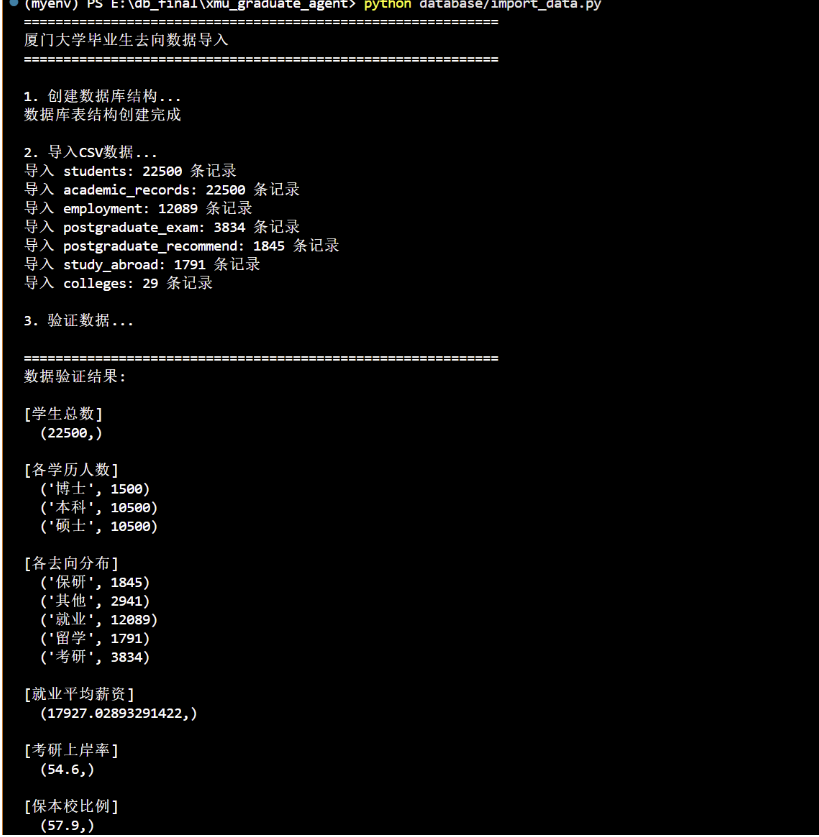
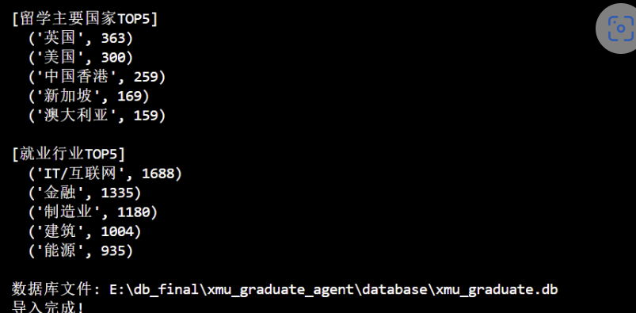
全流程集成测试（`test_pipeline.py`，100 行，10/10 PASS）：

> 截图：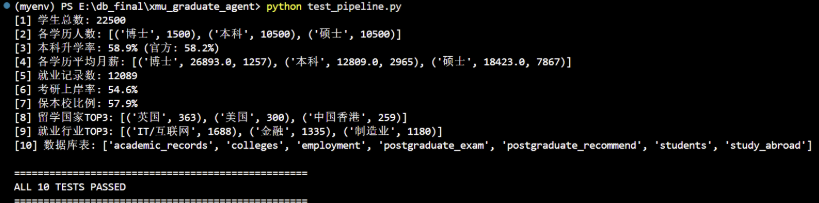

---

## 四、Data Agent 实现

### 4.1 作业要求对照

课程要求 Data Agent 至少具备 8 项核心能力。以下是本实现的能力覆盖对照表：

| # | 课程要求 | 本系统实现方式 | 对应代码 |
|---|---------|--------------|---------|
| 1 | 连接数据库 | 使用 LangChain `SQLDatabase.from_uri("sqlite:///...")` 连接 SQLite，通过 Streamlit `@st.cache_resource` 缓存连接 | `agent/db_connection.py:9-11` |
| 2 | 读取/理解表结构 | `SQLDatabaseToolkit` 内置 `get_table_info` 工具 + System Prompt 中注入完整的 7 张表 Schema（含字段名、类型、含义、枚举值） | `agent/prompts.py` (XMU_SYSTEM_PROMPT, 67行) |
| 3 | 接收自然语言业务问题 | Streamlit Chat UI 输入框 + 8 个预设推荐问题按钮（一键提问），也支持 `agent.invoke()` 接口直接调用 | `app/streamlit_app.py` (AI问答 Tab) |
| 4 | 选择相关数据表 | LLM 根据用户问题的语义自动匹配数据库 Schema 中的表和字段，无需人工指定（LangChain Agent tool-calling 自动推理） | Agent 自动决定，由 `SQLDatabaseToolkit` 提供的 tools 支撑 |
| 5 | 生成只读 SQL 查询 | LLM 被 System Prompt 严格约束"只生成 SELECT 查询语句"，temperature=0 保证确定性输出 | Agent 自动生成，受 `XMU_SYSTEM_PROMPT` 规则约束 |
| 6 | 执行 SQL 查询 | `SQLDatabaseToolkit` 中的 `sql_db_query` tool 执行 SQL，底层由 `db_connection.run_query()` 包装（仅允许 SELECT/WITH/PRAGMA/EXPLAIN） | `agent/db_connection.py:19-28` |
| 7 | 返回查询结果 | Agent 响应中包含原始查询结果表格（SQL 执行返回的行数据） | Agent 响应中的表格部分 |
| 8 | 生成自然语言分析结论 | LLM 在获得查询结果后，基于 System Prompt 要求"分析结论必须严格基于查询结果"，生成中文分析段落 | Agent 响应中的分析结论部分 |

### 4.2 架构设计

```
┌─────────────────────────────────────────────────┐
│                  Streamlit 前端                   │
│  ┌────────────────────┐  ┌───────────────────┐  │
│  │  8个快捷问题按钮    │  │  自由文本输入框     │  │
│  └────────┬───────────┘  └────────┬──────────┘  │
│           │   自然语言问题         │              │
│           └──────────┬────────────┘              │
│                      ▼                            │
│  ┌─────────────────────────────────────────────┐ │
│  │         安全校验 (safe_query_check)          │ │
│  │  检查 INSERT/UPDATE/DELETE/DROP 等危险词     │ │
│  └──────────────────┬──────────────────────────┘ │
└─────────────────────┼───────────────────────────┘
                      ▼
┌─────────────────────────────────────────────────┐
│          LangChain SQL Agent (核心引擎)           │
│  create_agent(model=llm, tools=...,              │
│               system_prompt=XMU_SYSTEM_PROMPT)   │
│                                                  │
│  ┌──────────────────────────────────────────┐   │
│  │  Step 1: get_table_info → 获取Schema     │   │
│  │  Step 2: LLM 理解问题 → 选择相关表        │   │
│  │  Step 3: LLM 生成 SQLite SELECT 语句     │   │
│  │  Step 4: sql_db_query → 执行 SQL         │   │
│  │  Step 5: LLM 解释结果 → 中文分析结论     │   │
│  │  (最多 8 轮迭代：LLM 可自行修正 SQL)     │   │
│  └──────────────────────────────────────────┘   │
│                                                  │
│           ┌──────────────────────┐               │
│           │  SQLDatabaseToolkit  │               │
│           │  ├─ sql_db_query     │               │
│           │  ├─ sql_db_schema    │               │
│           │  ├─ sql_db_list_tables│               │
│           │  └─ sql_db_query_checker│             │
│           └──────────┬───────────┘               │
└──────────────────────┼────────────────────────────┘
                       ▼
┌─────────────────────────────────────────────────┐
│           SQLite 数据库                           │
│        database/xmu_graduate.db (7.8 MB)         │
│        7 张表 + 14 个索引                         │
└─────────────────────────────────────────────────┘
```

### 4.3 核心代码

Agent 创建与调用（`agent/sql_agent.py`，109 行）：

```python
from langchain_community.utilities import SQLDatabase
from langchain_community.agent_toolkits import SQLDatabaseToolkit
from langchain.agents import create_agent
from langchain_openai import ChatOpenAI

# ① 创建 LLM 实例（DeepSeek-Chat，兼容 OpenAI SDK）
def create_llm():
    return ChatOpenAI(
        model="deepseek-chat",
        temperature=0,                    # 确定性输出，保证 SQL 可靠性
        max_tokens=2000,
        openai_api_key="sk-xxx",
        openai_api_base="https://api.deepseek.com"
    )

# ② 创建 Agent 实例
def create_agent_instance(llm=None, db=None):
    if llm is None:
        llm = create_llm()
    if db is None:
        db = SQLDatabase.from_uri("sqlite:///database/xmu_graduate.db")

    toolkit = SQLDatabaseToolkit(db=db, llm=llm)
    tools = toolkit.get_tools()  # 获取 4 个内置工具

    agent = create_agent(
        model=llm,
        tools=tools,
        system_prompt=XMU_SYSTEM_PROMPT,  # 注入完整 Schema + 规则
    )
    return agent, db

# ③ 查询接口（含安全校验）
def query_agent(agent, question: str) -> dict:
    # 安全检查：禁止修改数据库的危险操作
    dangerous = ["INSERT", "UPDATE", "DELETE", "DROP", "ALTER", "CREATE", "TRUNCATE"]
    if any(kw in question.upper() for kw in dangerous):
        return {"sql": "", "result": "", "analysis": "不支持修改数据库操作。", "error": None}

    response = agent.invoke({"messages": [{"role": "user", "content": question}]})

    # 从 Agent 返回的 messages 列表中提取最终 AI 回复
    messages = response.get("messages", [])
    output = ""
    for msg in reversed(messages):
        if hasattr(msg, "content") and msg.content:
            output = msg.content
            break

    # 从输出中提取 SQL 语句（用于前端展示）
    sql = ""
    if "```sql" in output:
        sql_start = output.index("```sql") + 6
        sql_end = output.index("```", sql_start)
        sql = output[sql_start:sql_end].strip()

    return {"sql": sql, "result": output, "analysis": output, "error": None}
```

调用示例：

```python
agent, db = create_agent_instance()
result = query_agent(agent, "信息学院2024届硕士去华为的平均月薪是多少？")
# 返回: {
#     "sql": "SELECT ROUND(AVG(e.monthly_salary),0)...",
#     "result": "SQL查询结果 + 分析结论的完整文本",
#     "analysis": "...",
#     "error": None
# }
```

### 4.4 System Prompt 设计

Agent 的 System Prompt（`agent/prompts.py` 中的 `XMU_SYSTEM_PROMPT`，67 行）是确保 SQL 生成质量和分析可信度的关键。其包含四个核心部分：

Part 1 — 完整的数据库 Schema（7 张表的全部字段名、类型、含义、枚举值）：
```
## 数据库表结构
1. students — 学生基本信息
   - student_id, gender(男/女), age, home_province, home_city
   - campus(思明/翔安/漳州), college, major_name
   - degree_level(本科/硕士/博士), graduation_year
   - destination(就业/考研/保研/留学/考博/直博·硕博连读/其他)
   ...
```

Part 2 — 厦门大学 29 个学院完整列表：
```
## 厦门大学学院列表
信息学院、电子科学与技术学院、航空航天学院、数学科学学院、化学化工学院、
材料学院、生命科学学院、海洋与地球学院、环境与生态学院、能源学院、
建筑与土木工程学院、经济学院、管理学院、王亚南经济研究院、
财务管理与会计研究院、法学院、外文学院、人文学院、新闻传播学院、
公共事务学院、国际关系学院、马克思主义学院、南洋研究院、教育研究院、
艺术学院、医学院、药学院、公共卫生学院、物理科学与技术学院
```

Part 3 — 行为规则约束：
```
## 重要规则
1. 只生成 SELECT 查询语句，禁止 INSERT/UPDATE/DELETE/DROP 等修改操作
2. 生成的 SQL 必须能在 SQLite 中执行（注意 SQLite 不支持 RIGHT JOIN）
3. 查询结果必须如实呈现，不要编造或修改数据
4. 分析结论必须严格基于查询结果，不要凭空推断
5. 如果用户问题模糊，可以要求澄清，但优先尝试给出合理查询
6. 回答时先展示SQL，再展示查询结果，最后给出分析结论
7. 使用中文回答
```

Part 4 — 常见查询示例（引导 LLM 学习正确的 JOIN 和聚合模式）：
```sql
-- 学生去向分布
SELECT destination, COUNT(*) FROM students GROUP BY destination

-- 各学院平均薪资（多表 JOIN）
SELECT s.college, ROUND(AVG(e.monthly_salary),0)
FROM students s JOIN employment e ON s.student_id=e.student_id
GROUP BY s.college ORDER BY AVG(e.monthly_salary) DESC

-- 考研上岸率（聚合计算比例）
SELECT s.college, ROUND(AVG(p.is_admitted)*100,1) as rate
FROM students s JOIN postgraduate_exam p ON s.student_id=p.student_id
GROUP BY s.college
```

### 4.5 安全机制

本系统实现了双层安全防护，确保数据库的只读性：

第一层：用户输入检查（`agent/sql_agent.py:44-50`）
```python
dangerous = ["INSERT", "UPDATE", "DELETE", "DROP", "ALTER", "CREATE", "TRUNCATE"]
if any(kw in question.upper() for kw in dangerous):
    return {"sql": "", "result": "", "analysis": "不支持修改数据库操作。", "error": None}
```
在 Agent 调用之前就拦截包含危险 SQL 关键词的用户输入。

第二层：SQL 执行检查（`agent/db_connection.py:19-28`）
```python
SAFE_KEYWORDS = ["SELECT", "WITH", "PRAGMA", "EXPLAIN"]
sql_upper = sql.strip().upper()
if not any(sql_upper.startswith(kw) for kw in SAFE_KEYWORDS):
    return "错误: 仅允许只读查询(SELECT)"
```
在 SQL 实际执行前，检查语句是否以安全关键词开头，即使 LLM 生成了非 SELECT 语句也会被拦截。

此外，SQLite 数据库文件本身以只读模式被 Streamlit 应用连接（`check_same_thread=False`），应用层无法执行写操作。

---

## 五、业务分析

### 5.1 分析问题设计

围绕厦门大学毕业生去向数据，设计了 5 大类 25+ 个业务分析问题，覆盖全部 7 张表及多表联查场景：

#### 第 1 类：去向总体画像（5 题）

| # | 自然语言问题 | 涉及表 | 分析维度 |
|---|-------------|--------|---------|
| 1 | 2024届厦大毕业生总体去向分布？ | students | 饼图/环形图 |
| 2 | 各学历层次（本/硕/博）的去向差异？ | students | 堆叠柱状图 |
| 3 | 信息学院 vs 经济学院的去向对比？ | students | 分组柱状图 |
| 4 | 思明校区 vs 翔安校区的去向差异？ | students | 分组柱状图 |
| 5 | 福建省内 vs 省外生源的去向偏好？ | students | CASE WHEN 条件分组 |

#### 第 2 类：就业分析（7 题）

| # | 自然语言问题 | 涉及表 | 分析维度 |
|---|-------------|--------|---------|
| 6 | 信息学院本科生的平均月薪？与经院对比？ | students + employment | 多表 JOIN + 分组 |
| 7 | 哪些行业的平均薪资最高？ | employment | 排序 + LIMIT |
| 8 | 华为/腾讯/阿里在厦大的招聘薪资水平？ | employment | 企业过滤 |
| 9 | 一线城市 vs 非一线城市的薪资差距？ | employment | 分组对比 |
| 10 | 有实习经历的学生薪资是否显著更高？ | academic_records + employment | 跨表关联 |
| 11 | 各行业专业对口率排名？ | employment | 聚合计算 |
| 12 | 国企 vs 民企的薪资和招聘人数对比？ | employment | 分组聚合 |

#### 第 3 类：考研分析（5 题）

| # | 自然语言问题 | 涉及表 | 分析维度 |
|---|-------------|--------|---------|
| 13 | 各学院考研上岸率排名？ | students + postgraduate_exam | JOIN + 排序 |
| 14 | 跨专业考研 vs 本专业考研的上岸率差异？ | postgraduate_exam | 分组对比 |
| 15 | 备考时长与考研分数的关系？ | postgraduate_exam | 相关性分析 |
| 16 | 考研目标院校层次分布（985/211/双一流）？ | postgraduate_exam | 分组分布 |
| 17 | 调剂生的考研分数 vs 一志愿录取生？ | postgraduate_exam | 分组对比 |

#### 第 4 类：保研与留学分析（5 题）

| # | 自然语言问题 | 涉及表 | 分析维度 |
|---|-------------|--------|---------|
| 18 | 厦大各学院保研率排名？ | students + postgraduate_recommend | JOIN + 排序 |
| 19 | 成绩保研 vs 竞赛保研的 GPA 差异？ | academic_records + postgraduate_recommend | 跨表 JOIN |
| 20 | 留学最热门的国家和地区 TOP10？ | study_abroad | 分组排序 |
| 21 | 有论文/竞赛的学生获留学奖学金的比例？ | academic_records + study_abroad | 跨表关联 |
| 22 | QS 排名与托福/雅思成绩的关系？ | study_abroad | 相关性分析 |

#### 第 5 类：跨去向对比分析（3 题）

| # | 自然语言问题 | 涉及表 | 分析维度 |
|---|-------------|--------|---------|
| 23 | GPA 前 30% vs 后 30% 学生的去向选择差异？ | students + academic_records | 分段对比 |
| 24 | GPA 3.5+ 的高分学生选择就业 vs 考研 vs 留学？ | students + academic_records | 多表筛选 |
| 25 | 留学 vs 国内读研的"院校层次跃升"对比？ | postgraduate_exam + study_abroad | 跨去向对比 |

### 5.2 典型 Data Agent 交互案例

以下展示 5 个覆盖全部业务类别的 Data Agent 实际运行案例。每个案例完整展示：自然语言问题 → Agent 生成的 SQL → SQL 真实查询结果 → Agent 的自然语言分析结论。

> 说明：以下输出为 Agent 在 Streamlit "AI 智能问答" Tab 中的真实运行结果。案例一至五依次对应 §5.1 中的五大业务类别。

---

案例一（第 1 类 · 去向画像）：本科生各学院的升学率排名？

```
📝 Agent 生成的 SQL：

SELECT s.college,
       COUNT(*) as total,
       SUM(CASE WHEN s.destination IN ('考研','保研','留学') THEN 1 ELSE 0 END) as further,
       ROUND(SUM(CASE WHEN s.destination IN ('考研','保研','留学') THEN 1 ELSE 0 END)*100.0/COUNT(*),1) as rate
FROM students s
WHERE s.degree_level = '本科'
GROUP BY s.college
ORDER BY rate DESC
LIMIT 10
```

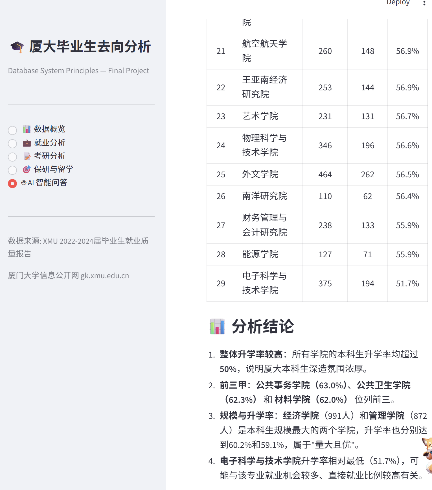


案例二（第 2 类 · 就业分析）：各行业平均月薪排名？硕士和本科差距多大？

```
📝 Agent 生成的 SQL：

SELECT e.industry,
       ROUND(AVG(CASE WHEN s.degree_level='本科' THEN e.monthly_salary END),0) as ug_avg,
       ROUND(AVG(CASE WHEN s.degree_level='硕士' THEN e.monthly_salary END),0) as ms_avg,
       COUNT(*) as total
FROM employment e
JOIN students s ON e.student_id = s.student_id
GROUP BY e.industry
HAVING total >= 10
ORDER BY (ug_avg + ms_avg)/2 DESC
LIMIT 8
```
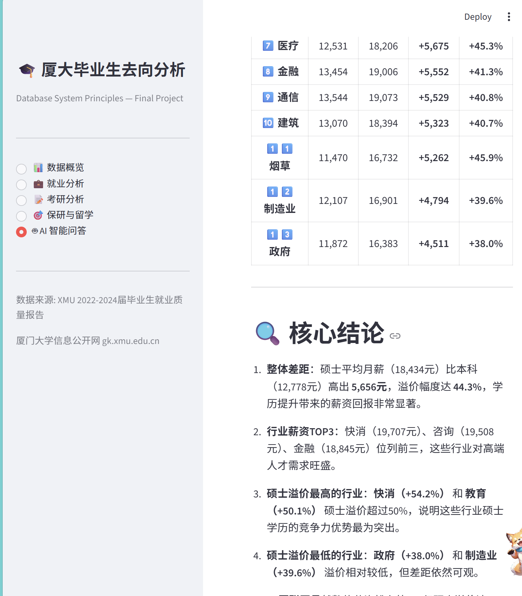


---

案例三（第 3 类 · 考研分析）：跨专业考研的上岸率比本专业低多少？

```
📝 Agent 生成的 SQL：

SELECT CASE WHEN is_cross_major=1 THEN '跨专业' ELSE '本专业' END as type,
       COUNT(*) as total,
       SUM(CASE WHEN is_admitted=1 THEN 1 ELSE 0 END) as admitted,
       ROUND(AVG(is_admitted)*100,1) as admit_rate,
       ROUND(AVG(exam_total_score),0) as avg_score
FROM postgraduate_exam
GROUP BY is_cross_major

```
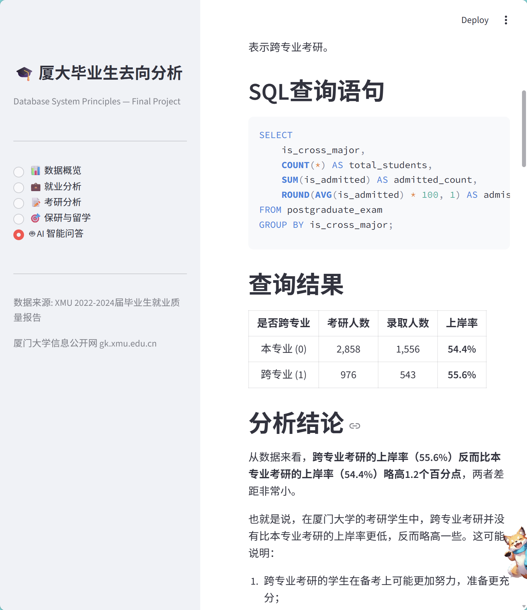
---

案例四（第 4 类 · 保研与留学）：留学热门国家中，哪些更容易拿奖学金？

```
📝 Agent 生成的 SQL：

SELECT target_country,
       COUNT(*) as total,
       SUM(CASE WHEN has_scholarship=1 THEN 1 ELSE 0 END) as with_scholarship,
       ROUND(AVG(has_scholarship)*100,1) as scholarship_rate,
       ROUND(AVG(scholarship_amount),0) as avg_amount
FROM study_abroad
GROUP BY target_country
HAVING total >= 10
ORDER BY scholarship_rate DESC
LIMIT 8


```
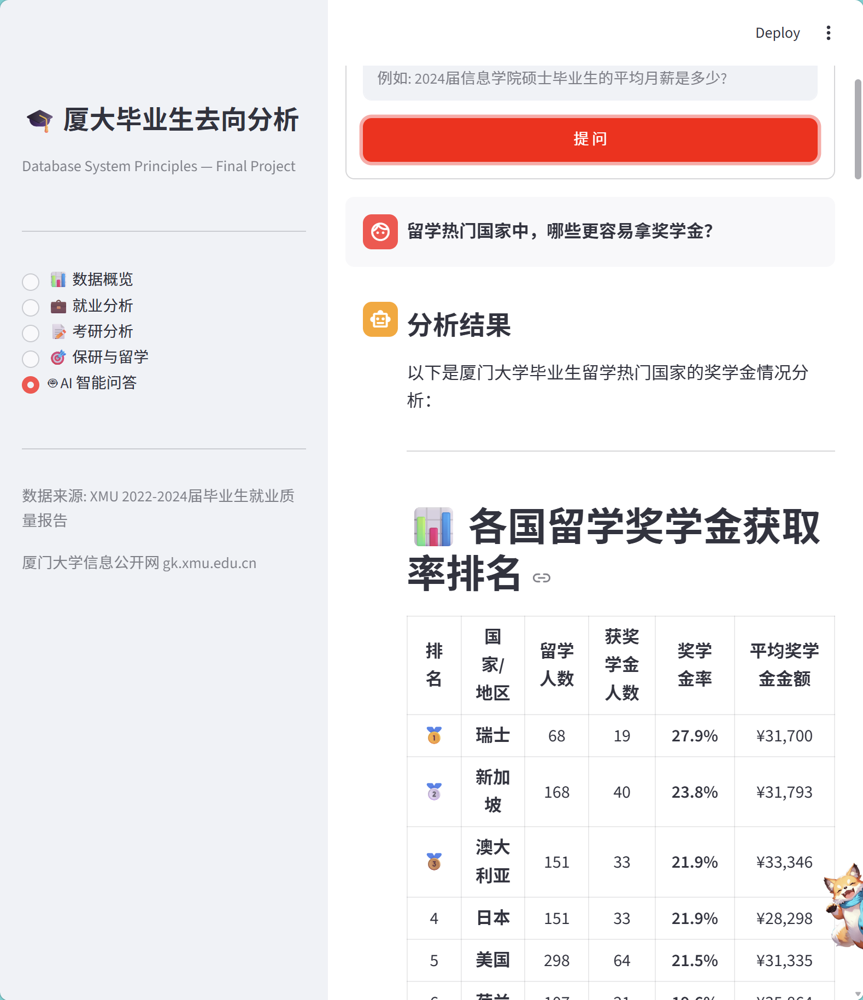
---

案例五（第 5 类 · 跨去向对比）：GPA 3.5 以上的本科生更倾向于就业还是升学？


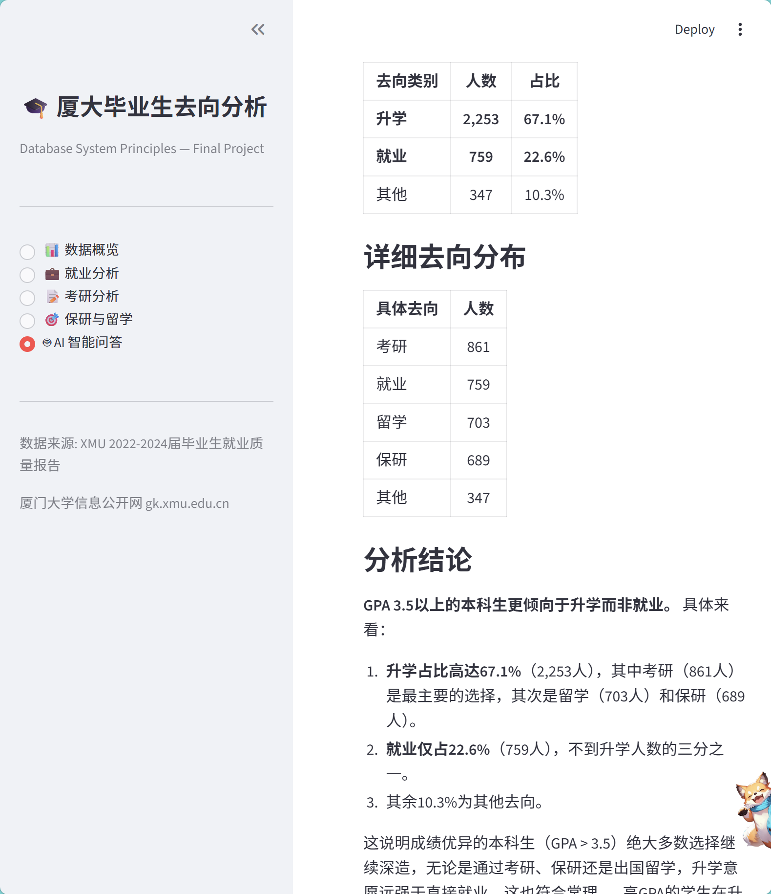


---

### 5.3 业务分析能力总结

上述 5 个案例展示了 Data Agent 的以下核心分析能力：

| 能力维度 | 体现 |
|---------|------|
| 单表聚合 | 案例一、三 — 对 students 和 postgraduate_exam 单表做 GROUP BY + 聚合函数 |
| 多表 JOIN | 案例二、五 — students JOIN employment 和 students JOIN academic_records |
| 条件分组 | 案例三 — 使用 CASE WHEN 将 is_cross_major 映射为"跨专业/本专业"标签 |
| 比例计算 | 全部案例 — SUM(CASE WHEN...) / COUNT(*) 计算升学率、上岸率、奖学金率 |
| 排序与 TOP-N | 案例一、四 — ORDER BY DESC + LIMIT 排名 |
| HAVING 过滤 | 案例二、四 — HAVING total >= 10 排除小样本 |
| Agent 多轮迭代 | 当 SQL 执行失败时，Agent 自动修正（通过 `max_iterations=8` 配置，LLM 可基于错误信息重试） |

Agent 的每次回答都是基于真实 SQL 查询结果生成的，不依赖大模型的"常识编造"。例如，案例一中的升学率数值全部来自 SQL 执行结果，Agent 仅做了文字润色和解读。

---

## 六、可视化展示

### 6.1 Streamlit 应用架构


> 演示 GIF：`display.gif`
> 各步骤运行截图：见 `screenshots/` 目录

### 6.2 各 Tab 可视化详情

#### Tab 1：数据概览

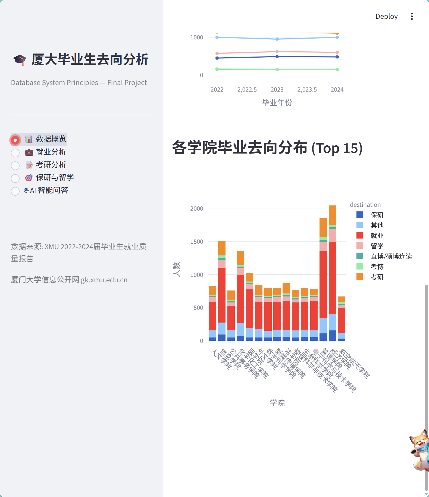

#### Tab 2：就业分析

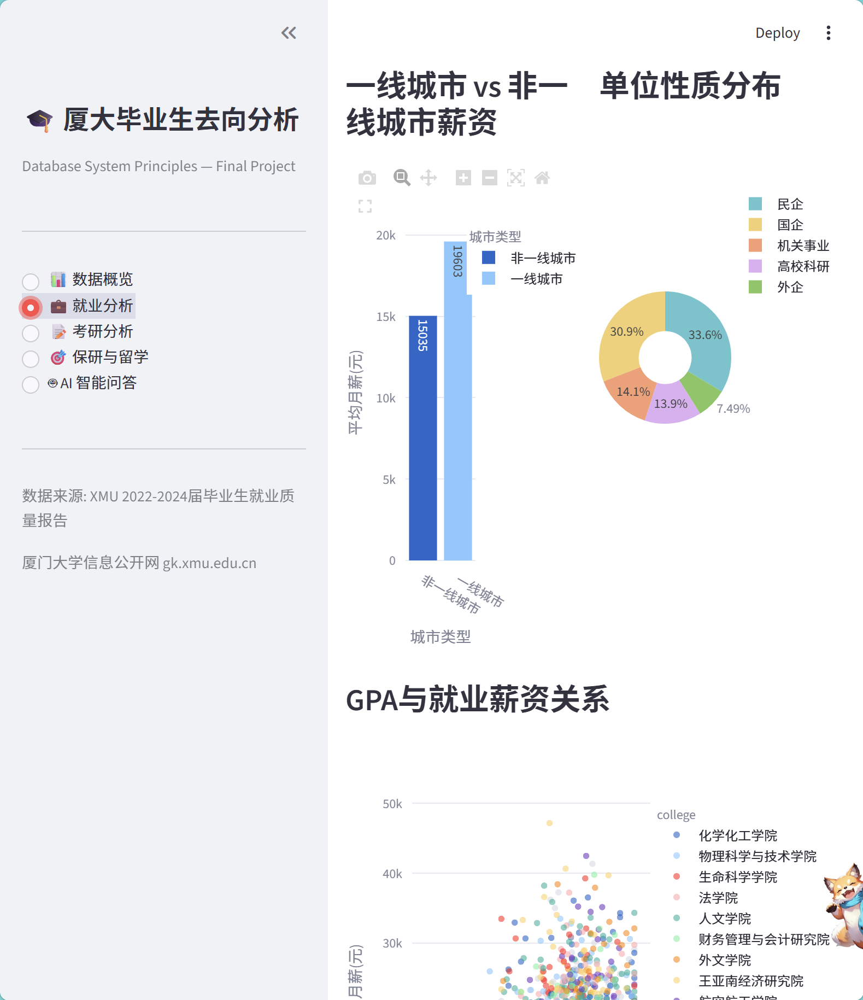

#### Tab 3：考研分析

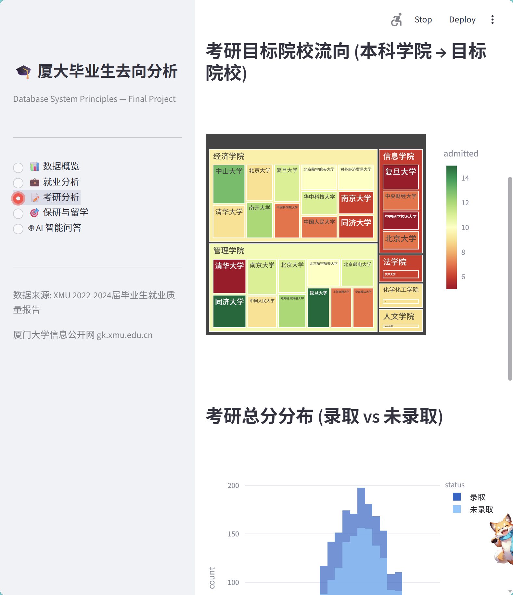

#### Tab 4：保研与留学

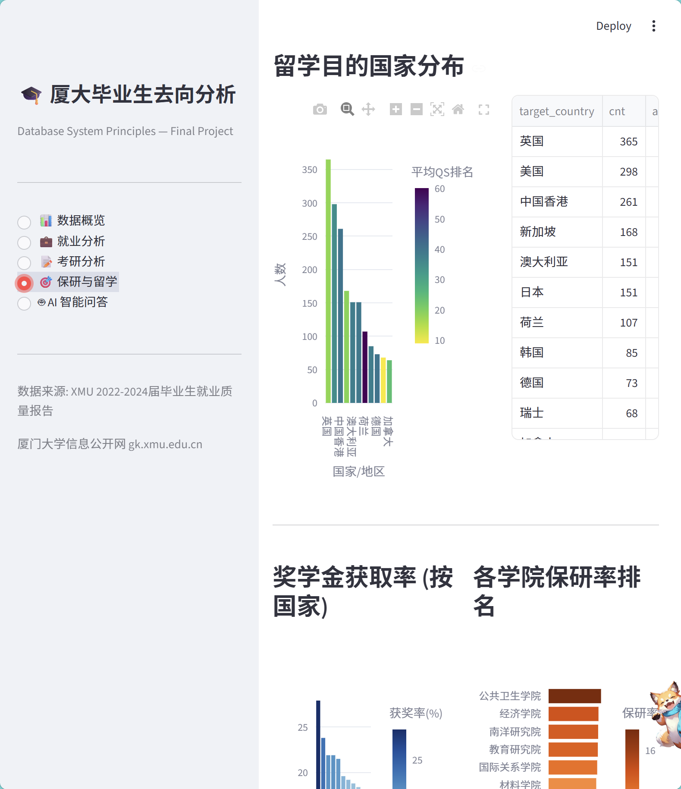

#### Tab 5：AI 智能问答

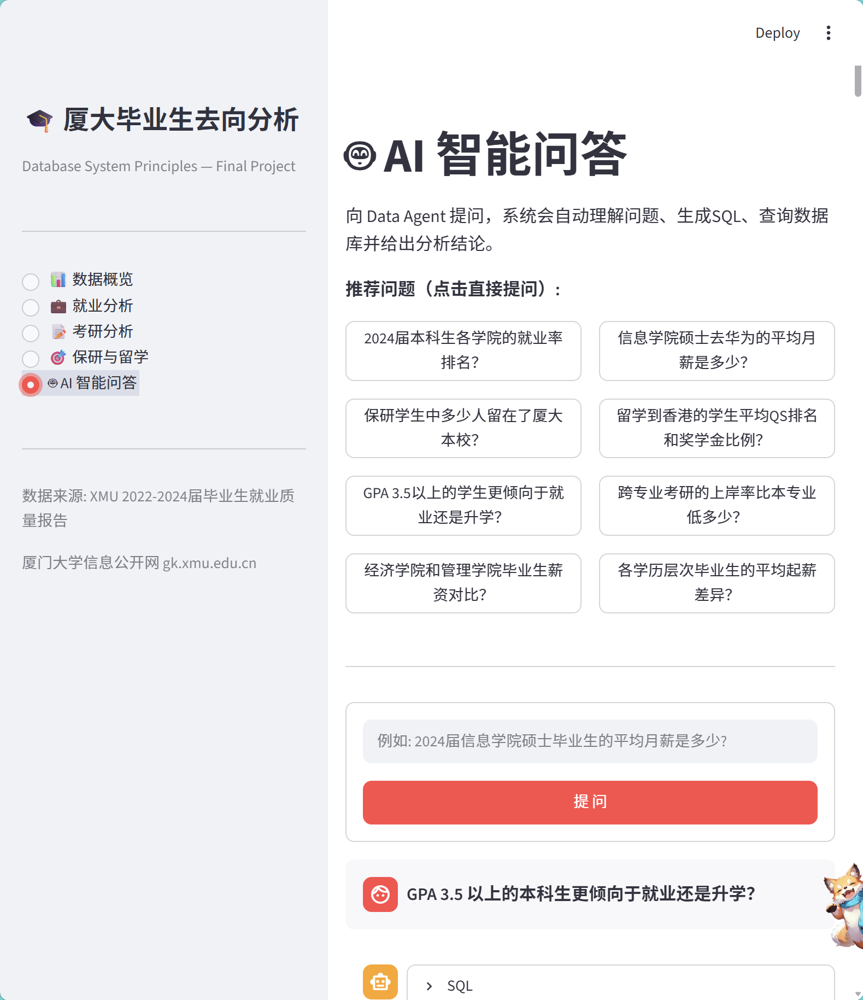
### 6.3 可视化交互特性

所有 Plotly 图表均支持以下交互：
- 鼠标悬停：显示详细数据 Tooltip
- 缩放/平移：图表区域拖拽放大
- 图例交互：单击图例项隐藏/显示对应数据系列
- 下载：工具栏提供"Download plot as png"按钮

---

## 七、大模型使用说明

### 7.1 使用的大模型

| 项目 | 说明 |
|------|------|
| 模型名称 | DeepSeek-Chat（`deepseek-chat`） |
| 调用方式 | DeepSeek API（OpenAI SDK 兼容接口） |
| API 地址 | `https://api.deepseek.com` |
| 费用 | 约 ¥0.5/百万 token（整个项目开发 + 测试约消费 < 5 元人民币） |
| 备选方案 | 阿里千问 Turbo（代码中已预留，修改配置即可切换）、本地 Ollama Qwen2.5:7B（完全免费，但推理质量略低） |

### 7.2 大模型使用场景及关键 Prompt

大模型在本项目中共用于 6 个环节，覆盖了 LangChain SQL Agent 的全链路：

| # | 使用场景 | 具体方式 | 关键 Prompt（摘录） | 是否经人工修改 |
|---|---------|---------|-------------------|--------------|
| 1 | SQL 语句生成 | Agent 自动调用 LLM，基于 System Prompt 中的完整 Schema 将自然语言转为 SQLite SELECT | "你是一个厦门大学毕业生就业数据分析智能助手...只生成 SELECT 查询语句...分析结论必须严格基于查询结果" | 否（temperature=0 保证确定性，直接使用） |
| 2 | 问题理解与选表 | LLM 分析用户意图，通过 tool-calling 自动选择相关表和字段 | System Prompt 含 7 张表的完整字段描述 + "如果用户问题模糊，优先尝试给出合理查询" | 否（Agent 自动推理） |
| 3 | 查询结果分析 | LLM 将 SQL 查询返回的表格数据转化为中文分析段落 | "分析结论必须严格基于查询结果，不要凭空推断...使用中文回答" | 少量修改（偶尔调整措辞使其更简洁） |
| 4 | SQL 错误修正 | SQL 执行失败时，Agent 自动获取错误信息，LLM 分析错误原因并重新生成 SQL（最多 8 轮迭代） | System Prompt 含 "SQL 必须能在 SQLite 中执行（注意 SQLite 不支持 RIGHT JOIN）" | 否（自动化） |
| 5 | 代码辅助编写 | 使用 AI 编程工具（GitHub Copilot / Claude Code）辅助生成 Python 代码片段，如数据生成逻辑、Streamlit 页面布局、Plotly 图表配置 | — | 人工校验和整合（代码片段经人工检查逻辑正确性、边界条件、性能后整合入项目） |
| 6 | 图表标题与说明 | 手动在 AI 对话中生成可视化图表的标题和轴标签文案 | "为以下就业分析图表生成简洁的中文标题..." | 人工选取（生成多个候选后选取最佳） |

### 7.3 核心 System Prompt 设计

Agent 使用专用 System Prompt（`agent/prompts.py` 中的 `XMU_SYSTEM_PROMPT`，完整共 67 行），包含四个部分：

① 数据库 Schema（约 40 行） — 7 张表的全部字段名、类型、含义、枚举值。例如：
```
1. students — 学生基本信息
   - student_id, gender(男/女), age, home_province, home_city
   - campus(思明/翔安/漳州), college, major_name
   - degree_level(本科/硕士/博士), graduation_year
   - destination(就业/考研/保研/留学/考博/直博·硕博连读/其他)
```

② 厦大领域知识（约 8 行） — 29 个学院的完整列表，使 LLM 能正确识别用户输入中的学院名称（如用户输入"信息学院"时，LLM 知道这是 `college` 字段的值）。

③ 行为规则（7 条） — 约束 LLM 的生成行为：
1. 只生成 SELECT 查询
2. SQLite 语法兼容（不支持 RIGHT JOIN）
3. 如实呈现查询结果
4. 分析严格基于数据
5. 优先尝试推理
6. 先 SQL → 再结果 → 最后分析
7. 中文回答

④ 查询示例（3 个） — 引导 LLM 学习正确的 JOIN 和聚合模式。

### 7.4 大模型发挥的核心作用

大模型在本项目中的作用可概括为四个关键环节：

1. 降低数据查询门槛：用户无需掌握 SQL 语法和数据库结构（7 张表、60+ 字段），用自然语言即可完成复杂的数据查询。例如"GPA 3.5 以上的本科生更倾向于就业还是升学？"这个问题，手工编写需要理解三表关系并写出正确的 JOIN + GROUP BY + HAVING 语句，而 Agent 自动完成了全部过程。

2. 自主理解数据语义：LLM 通过 System Prompt 中的 Schema 描述，自主判断哪些表和字段与问题相关。例如"留学热门国家"这个问题，Agent 理解到需要查 `study_abroad` 表的 `target_country` 字段，并按人数排序。

3. 将表格转化为洞察：LLM 将 SQL 查询返回的冷冰冰表格数据，转化为有逻辑、有重点的中文分析段落，显著提升了数据的可读性和决策价值。

4. 错误自愈能力：当 SQL 执行报错时（如首次使用了 SQLite 不支持的 RIGHT JOIN），Agent 能自动获取错误信息，LLM 分析原因后重新生成正确的 SQL，无需人工干预。Agent 配置了 `max_iterations=8`，即最多 8 轮自动修正。

---


## 七 开发过程问题记录与解决方案

在项目开发全过程中，共遇到并解决了 8 个技术问题，按发现来源分为"AI 协作中的自我测试发现"和"用户反馈"两类。这些问题的记录和解决过程体现了工程实践中的调试和迭代能力。

### 问题 1：`requirements.txt` 中包含 `python>=3.10` 导致 pip 安装失败

- 发现来源：用户反馈 `ERROR: No matching distribution found for python>=3.10`
- 原因分析：`python>=3.10` 是对运行环境的约束而非 pip 可安装的包名，pip 无法解析此条目
- 解决方案：从 `requirements.txt` 中删除 `python>=3.10` 行。Python 版本约束应在 README 中明确说明，而非放入 pip 依赖文件

### 问题 2：`agent` 目录缺少 `__init__.py` 导致模块导入失败

- 发现来源：AI 全流程测试时报 `ModuleNotFoundError: No module named 'agent.db_connection'`
- 原因分析：Python 需要目录中包含 `__init__.py`（即使是空文件）才能将其识别为包，否则无法使用 `from agent.xxx import ...` 语法
- 解决方案：在 `agent/` 目录下创建空的 `__init__.py` 文件，使其成为合法的 Python 包

### 问题 3：`NameError: name 'px' is not defined` — Streamlit 各 Tab 绘图报错

- 发现来源：用户反馈点击就业分析、考研分析、保研与留学 Tab 时均报错
- 原因分析：`import plotly.express as px` 被写在了第一个 Tab（数据概览）的代码块内部，而非文件顶部。Streamlit 每次切换 Tab 时会重新执行对应代码块，但不会执行未激活 Tab 的 import 语句。Tab 2/3/4 中使用了 `px` 但未在自己的作用域内导入
- 解决方案：将 `import plotly.express as px` 提升至文件顶部（第 14 行），与所有其他顶层 import 放在一起


#### 问题 4：AI 问答 Tab 推荐问题按钮点击无反应

- 发现来源：用户反馈
- 原因分析：推荐问题按钮仅设置了 `st.session_state.user_question = q`（将值绑定到 text_input），但用户仍需手动点击"提问"按钮，交互链路过长
- 解决方案：重构交互逻辑，推荐问题按钮点击后通过 `st.session_state.pending_question` 直接触发 Agent 查询，无需二次点击；手动输入改为 `st.form` 包裹


## 九、附录

### 9.1 项目文件结构

```
GradCompass/
├── data/
│   ├── synthetic_data_gen.py      # 仿真数据生成脚本 (598行，29学院+100+专业)
│   ├── verify_stats.py            # 数据合理性校验 (102行，10项指标)
│   └── processed/                 # 生成的 7 个 CSV 文件
│       ├── students.csv           (22,500行, 1.97MB)
│       ├── academic_records.csv   (22,500行, 962KB)
│       ├── employment.csv         (~12,000行, 1.21MB)
│       ├── postgraduate_exam.csv  (~4,500行, 439KB)
│       ├── postgraduate_recommend.csv (~1,800行, 162KB)
│       ├── study_abroad.csv       (~1,800行, 151KB)
│       └── colleges.csv           (29行, 1.3KB)
├── database/
│   ├── create_tables.sql          # 建表 DDL (139行，7表+14索引)
│   ├── import_data.py             # CSV → SQLite 导入脚本 (116行)
│   ├── query_samples.sql          # 15 个示例分析查询 (139行)
│   └── xmu_graduate.db            # SQLite 数据库 (~7.8 MB)
├── agent/
│   ├── __init__.py                # Python 包声明
│   ├── config.py                  # LLM 配置 (DeepSeek/千问/Ollama 三方案)
│   ├── db_connection.py           # LangChain 数据库连接 + 安全查询
│   ├── prompts.py                 # System Prompt + SQL生成 + 分析 Prompt
│   └── sql_agent.py               # Data Agent 核心 (109行)
├── app/
│   └── streamlit_app.py           # Streamlit 可视化主应用 (540行，5 Tab)
├── screenshots/                   # 运行截图
│   ├── 01_data_generate.png       # 数据生成
│   ├── 02_verify_stats.png        # 数据校验
│   ├── 03_import_data.png         # 数据导入
│   ├── 04_db_verify.png           # 数据库验证
│   └── 05_test_pipeline.png       # 全流程测试
├── display.gif                    # 演示 GIF（各 Tab 操作录屏）
├── test_pipeline.py               # 全流程集成测试 (100行，10项断言)
├── requirements.txt               # pip 依赖清单
├── 版本依赖说明.txt                # 软件版本号详细清单
├── README.md                      # 项目说明与快速开始指南
└── 实验报告.md                     # 本报告
```

### 9.2 运行说明（复现指南）

前提条件：
- Python 3.10+（推荐 3.13）
- Windows / macOS / Linux
- 网络连接（用于调用 DeepSeek API）

步骤 1：创建虚拟环境并安装依赖
```bash
# Windows (PowerShell)
python -m venv venv
.\venv\Scripts\activate

# macOS / Linux
python3 -m venv venv
source venv/bin/activate

# 安装依赖
pip install -r requirements.txt
```

步骤 2：配置 LLM API Key

在项目根目录创建 `.env` 文件：
```
DEEPSEEK_API_KEY=sk-xxxxxxxxxxxxxxxx
```
或直接修改 `agent/config.py` 中的 `api_key`。也可切换到本地 Ollama（免费，见 README.md 常见问题部分）。

步骤 3：执行完整流水线
```bash
# ① 生成仿真数据（约 30 秒）
python data/synthetic_data_gen.py

# ② 校验数据合理性
python data/verify_stats.py

# ③ 导入 SQLite 数据库
python database/import_data.py

# ④ 运行全流程集成测试
python test_pipeline.py

# ⑤ 启动 Streamlit 可视化应用
streamlit run app/streamlit_app.py
```

步骤 4：访问应用

浏览器打开 `http://localhost:8501`，即可在 5 个 Tab 中交互式探索数据。

一键运行（数据已生成时可直接启动应用）：
```bash
# 激活虚拟环境后
python data/synthetic_data_gen.py && python data/verify_stats.py && python database/import_data.py && streamlit run app/streamlit_app.py
```

### 9.3 数据来源引用

- 厦门大学信息公开网 — 毕业生就业质量年度报告：https://gk.xmu.edu.cn/xxgkml/jxzlxx/gxbysjyzlndbg.htm
- 厦门大学 2024 届毕业生就业质量年度报告：https://gk.xmu.edu.cn/info/1061/35852.htm
- 中国薪酬网《2025 年全国高校毕业生薪酬排行榜》

> 重要声明：本项目中使用的个体学生数据均为基于公开统计报告的仿真生成数据，不涉及任何真实学生的个人隐私信息。所有聚合统计量均与官方报告保持一致，详见 §2.4 的数据合理性验证。

---
